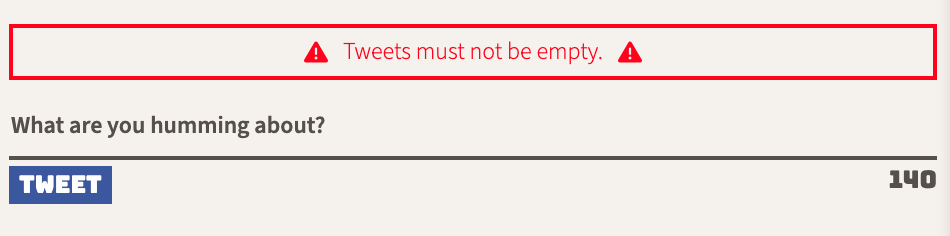

# Tweeter Project

Tweeter is a simple, single-page AJAX-based Twitter clone that uses jQuery, HTML5, and SASS.

## Getting Started

1. Install dependencies using the `npm install` command.
2. Start the web server using the `npm run local` command. The app will be served at <http://localhost:8080/>.
3. Go to <http://localhost:8080/> in your browser.

## Dependencies

- Express
- Node 5.10.x or above
- Body-parser
- Chance
- SASS

## Screenshots

> User clicks new tweet icon to be brought to the page form

> User can enter new tweets in the form

> A new card appears when tweet form is submitted

> Error messages appear when invalid input is detected

> Return to top button appears when page is able to scroll down far enough. Clicking this returns the user to the form